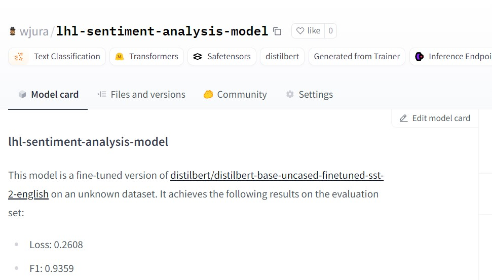

# LLM Project for Sentiment Analysis

## Project task 
I have chosen NLP for a **sentiment analysis task**, aiming to train a model that interprets whether a movie review is positive or negative. This type of NLP is valuable because understanding audience sentiment enables filmmakers and streaming platforms to enhance content recommendations and tailor marketing strategies effectively.

## Dataset
I have chosen the [IMDb](https://huggingface.co/datasets/stanfordnlp/imdb) dataset for a binary sentiment classification task (positive vs. negative). It contains 25,000 highly polarized movie reviews for training and 25,000 for testing, along with additional unlabeled data that can be utilized for further analysis or model tuning.

## Pre-trained model
I have chosen [distilbert-base-uncased-finetuned-sst-2-english](https://huggingface.co/distilbert/distilbert-base-uncased-finetuned-sst-2-english) model from HuggingFace for the sentiment analysis task. 

DistilBERT is a smaller, faster, and more efficient version of BERT (Bidirectional Encoder Representations from Transformers) created through a process called knowledge distillation. Developed by Hugging Face, DistilBERT retains around 97% of BERT’s language understanding capabilities but has 40% fewer parameters and runs about 60% faster, making it ideal for tasks requiring high performance and efficiency, such as text classification and sentiment analysis.

## Performance metrics
I've decided to use F1 score for the performance metrics, beside the other metrics included in evaluation module. 

The results before and after tuning are as follows:

| Metric             | Before tuning | After tuning      |
| ------------------ | ------------- | ------------------|
| F1 Score           | 0.9336        | 0.9359            |
| Evaluation Loss    | 0.1861        | 0.2608            |
| Evaluation Runtime | 411.40        | 420.37            |
| Samples Per Second | 60.77         | 59.47             |
| Steps Per Second   | 3.80          | 1.86              |

Overall, the tuning process resulted in a marginal increase in the F1 score, suggesting improved model performance in sentiment classification, despite a slight rise in loss and decreased processing speed.

## Hyperparameters

**Learning Rate:** Increased from 2e-5 to 3e-5. The learning rate controls how quickly the model learns. Increasing the learning rate helped the model learn faster while still being stable.

**Batch Size:** Increased from 16 to 32 for both training and evaluation. Batch size affects how the model generalizes and trains. Larger batches can speed up training and provide more accurate learning but need more memory. By increasing the batch size from 16 to 32, the model used more data at once.

**Number of Training Epochs:** Increased from 1 to 3.  The number of epochs indicates how many times the model sees the training data. More epochs can improve learning, but too many can cause overfitting, where the model learns the training data too well and struggles with new data.
After increasing the epochs from 1 to 3 the model to learned more from the data, enhancing its ability to understand sentiment, which helped improve the F1 score.

## Relevant Links

[Link to my model](https://huggingface.co/wjura/lhl-sentiment-analysis-model) on Hugging Face.

Link to the [IMDb](https://huggingface.co/datasets/stanfordnlp/imdb) dataset used for training model.
